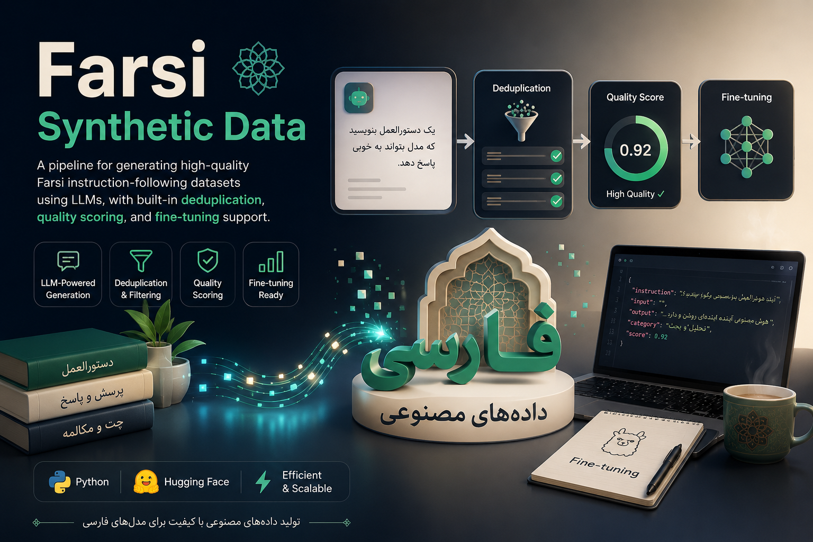
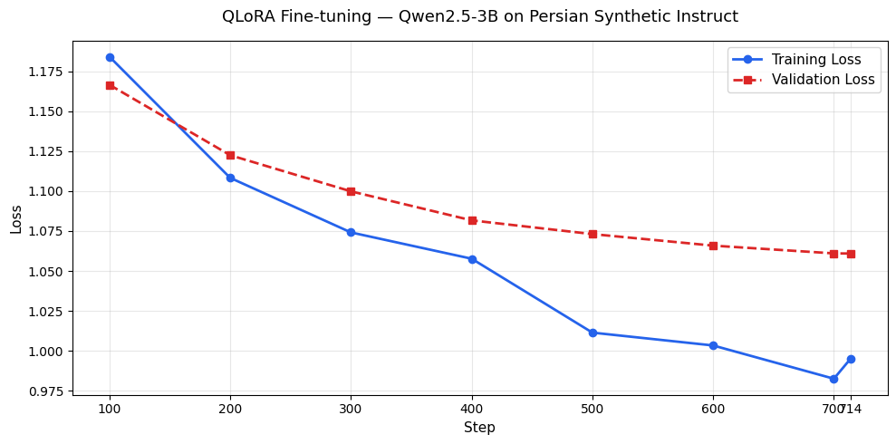

# Farsi Synthetic Data

A pipeline for generating high-quality Farsi instruction-following datasets using LLMs, with built-in deduplication, quality scoring, and fine-tuning support.



## Results

| | Value |
|---|---|
| Dataset | [Heydaritoday/Persian-Synthetic-Instruct](https://huggingface.co/datasets/Heydaritoday/Persian-Synthetic-Instruct) |
| Fine-tuned Model | [Heydaritoday/Persian-Qwen2.5-3B-Instruct](https://huggingface.co/Heydaritoday/Persian-Qwen2.5-3B-Instruct) |
| Total pairs | ~4,000 |
| Domains | 51 |
| Subtopics | ~350 |
| Generation models | gpt-4.1-mini + gpt-4.1-nano |
| Fine-tuning method | QLoRA (Unsloth) |
| Base model | Qwen2.5-3B-Instruct |

## Overview

This project addresses the lack of high-quality Farsi instruction-following data for training language models. The pipeline generates diverse, realistic instruction-response pairs across 51 domains, then fine-tunes a language model on the resulting dataset.

Each generated sample follows the standard instruction-tuning format:

```json
{
  "instruction": "چطور می‌تونم برای کنکور ریاضی آماده بشم؟",
  "input": "",
  "output": "برای آمادگی کنکور ریاضی...",
  "topic": "آموزش و تحصیل",
  "subtopic": "کنکور و آزمون"
}
```

## Project Structure

```
.
├── topic_tree.json        # Topic hierarchy (51 domains, ~350 subtopics)
├── prompts.py             # Prompt templates for the LLM
├── generator.py           # Main data generation pipeline
├── dedup.py               # Deduplication script
├── quality_scorer.py      # Quality evaluation using a second LLM
├── persian_finetune_colab.ipynb  # Google Colab notebook (recommended)
├── output/                # Generated JSONL datasets (one file per domain)
└── requirements.txt
```

## Pipeline

```
Topic Tree → LLM Generation → Deduplication → Quality Scoring → Fine-tuning → Benchmark
```

**Step 1 — Generate data:**
```bash
python generator.py
```

**Step 2 — Remove duplicates:**
```bash
python dedup.py
```

**Step 3 — Score quality:**
```bash
python quality_scorer.py
```

**Step 4 — Fine-tune (Colab recommended):**

Open `persian_finetune_colab.ipynb` in Google Colab with a T4 GPU.

## Setup

**1. Clone the repository**

```bash
git clone https://github.com/MohammadHeydari/FarsiSyntheticData
cd FarsiSyntheticData
```

**2. Install dependencies**

```bash
python -m venv .venv
source .venv/bin/activate      # Linux / macOS
.venv\Scripts\activate         # Windows

pip install -r requirements.txt
```

**3. Configure API key**

```env
AVALAI_API_KEY=your_api_key_here
```

This project uses the [AvvalAI API](https://docs.avalai.ir), compatible with the OpenAI SDK.

## Configuration

All settings are in the `CONFIG` dictionary inside `generator.py`:

| Parameter | Default           | Description |
|---|-------------------|---|
| `model` | `gpt-4.1-mini + gpt-4.1-nano` | LLM model for generation |
| `pairs_per_call` | `3`               | Pairs generated per API call |
| `calls_per_subtopic` | `2`               | API calls per subtopic |
| `delay_between_calls` | `0.3`             | Seconds between calls |
| `max_tokens` | `1500`            | Max tokens per response |

## Quality Pipeline

**Deduplication** removes near-duplicate instructions using similarity matching:
```python
run(threshold=0.75)  # lower = stricter
```

**Quality scoring** evaluates each pair on three criteria using a second LLM:
- `fluency` — natural and fluent Farsi
- `relevance` — response answers the instruction
- `quality` — accurate and complete

Pairs scoring below 3.5/5 average are removed.

## Fine-tuning Results

Fine-tuned on `Qwen2.5-3B-Instruct` using QLoRA via Unsloth on Google Colab T4:

| Step | Training Loss | Validation Loss |
|---|---|---|
| 100 | 1.184 | 1.166 |
| 300 | 1.074 | 1.099 |
| 500 | 1.011 | 1.073 |
| 700 | 0.982 | 1.061 |
| 714 | 0.995 | 1.060 |



Training and validation loss over 714 steps (3 epochs) of QLoRA fine-tuning on Qwen2.5-3B-Instruct using the Persian Synthetic Instruct dataset. Both losses decrease consistently with no signs of overfitting.
## Topic Coverage

51 domains including:

- Mathematics, Physics, Chemistry, Biology
- Artificial Intelligence, Programming, Web Development
- Medicine, Psychology, Nutrition
- History, Philosophy, Sociology
- Persian Literature, Linguistics
- Economics, Management, Entrepreneurship
- Art, Cinema, Music
- Sports, Travel, Cooking

## License

Apache 2.0

## Benchmark — Base vs Fine-tuned

Comparison between `Qwen2.5-0.5B-Instruct` (base) and the fine-tuned model on sample Farsi questions:

---

**Q1: تفاوت SSD و HDD چیه؟**

| | Response |
|---|---|
| **Base** | التفاوت بين SSD و HDD... *(responded in Arabic)* |
| **Fine-tuned** | SSD (Solid State Drive) و HDD (Hard Disk Drive) هر دو نوع ابزارهای ذخیره‌سازی داده هستند، اما تفاوت‌های مهمی دارند... |

---

**Q2: چطور می‌تونم استرس رو کاهش بدم؟**

| | Response |
|---|---|
| **Base** | برای گذاشتار (کاهش) از چند سطر یا چه دلخواه... *(incoherent, repetitive)* |
| **Fine-tuned** | برای کاهش استرس، ابتدا باید نوع استرس خود را شناسایی کنید؛ مثلاً استرس عملیاتی یا فردی. سپس، تمرینات روان‌شناسی مثل تمرینات روحی... |

---

**Q3: هوش مصنوعی چیه و چطور کار می‌کنه؟**

| | Response |
|---|---|
| **Base** | اوش مصنوعی است. این گونه نام یا نمایش دستورات... *(incomplete, incoherent)* |
| **Fine-tuned** | هوش مصنوعی (AI) به روش‌هایی اشاره داره که ماشین‌ها و سیستم‌های کامپیوتری با استفاده از داده‌ها و الگوریتم‌های خاص، تصمیم‌گیری و عملیات را انجام می‌دهن... |

---

**Key observations:**
- Base model responded in Arabic on Farsi questions
- Base model produced incoherent and repetitive outputs
- Fine-tuned model consistently responds in fluent Farsi
- Fine-tuned model follows the instruction-response structure correctly